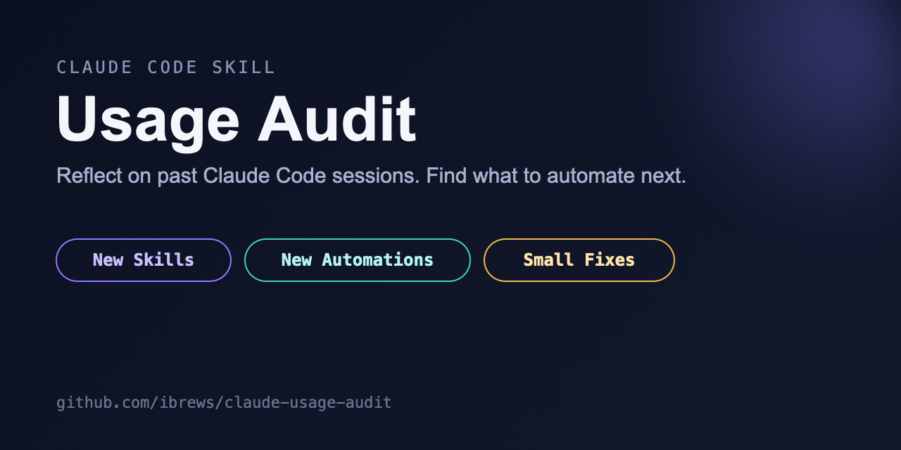

<p align="center">
  
</p>

# usage-audit

A [Claude Code](https://claude.com/claude-code) skill for the "reflect on
past sessions" pattern: instead of guessing what skills or automations you
need, mine the sessions you've already run for repeated manual work,
recurring friction, and workflows with a stable enough shape to script.

It doesn't implement anything. It hands you a ranked, evidence-backed list —
new skills, new automations, small config fixes — and you decide what's
worth building.

## Why

Most Claude Code setups accumulate the same way: a workflow gets re-typed a
dozen times before anyone notices it's a skill; a service gets restarted by
hand for weeks before anyone scripts the restart; a monitoring job checks
once a week while the thing it's checking breaks every few days. None of
this is visible from inside any single session — it only shows up once you
look across many of them.

This skill automates that look-back. It's built around one hard constraint:
**mining a month of transcripts is a job for a cheap model, not your
frontier one.** Four narrow-scope subagents (on Haiku/Sonnet-tier models)
do the raw digging; only the final clustering-and-ranking pass runs on your
main session's model.

## Install

```bash
git clone https://github.com/ibrews/claude-usage-audit ~/.claude/skills/usage-audit
```

Or copy `SKILL.md` directly into `~/.claude/skills/usage-audit/SKILL.md`.

## Use

In a Claude Code session:

> Run a usage audit — find the highest-leverage things we should automate
> or turn into skills.

Or schedule it monthly if your setup supports scheduled/cron-style agent
runs.

## Things to Try

1. **Run it once with a 1-week window** — narrow the "Setup" step to the last
   7 days on a machine you use daily. You should get back a short report
   even if some miners (claude-mem, daily logs) find nothing to say.
2. **Check what Miner 4 finds stale** — run just the live-inventory commands
   by hand first. If you spot a cron job or scheduled task with no recent
   output, that's the exact class of finding this skill exists to surface.
3. **Read the date-bucketing example and try it on your own repo** — swap in
   a path you suspect had a fix land recently; a commit-count cliff means
   the audit would otherwise over-rank a dead issue.
4. **Run it on two machines you use** and diff the reports — one machine
   skewing almost entirely toward automation (near-zero typed prompts) is a
   real signal, not a bug in the miner.
5. **Re-run it a month later** and check the "read the most recent past
   report first" instruction actually holds — nothing from the prior run's
   implementation log should resurface as a new finding.

## What it mines

| Source | What it's looking for |
|---|---|
| Daily logs / notes (if you keep them) | The same task showing up on many different days |
| Local session transcripts (`~/.claude/projects/`) | Repeated prompt shapes, repeated shell commands, script-shaped work running as sessions |
| [claude-mem](https://github.com/thedotmack/claude-mem) observations (optional) | Cross-session patterns with citable IDs |
| Live skill/hook/cron/scheduled-task inventory | What already exists, and what's silently broken (stale paths, dead cron output) |

## What comes out

A single report clustered into three batches, each item carrying its own
evidence and a HIGH/MEDIUM/LOW leverage call:

- **New skills** — workflows re-improvised from scratch across many
  sessions.
- **New automations** — checks or jobs that are being done by hand, or
  existing automations whose cadence doesn't match how often they actually
  fail.
- **Small fixes** — a stale path, a hook firing on the wrong trigger, a doc
  that contradicts the code.

Plus a **Considered, no action** section, so the next run doesn't re-derive
a rejection you already made.

## The one lesson worth reading before you run this

Date-bucket every frequency claim *before* ranking it. The first real run of
this skill nearly shipped a #1 finding built on stale evidence — almost all
of the flagged activity had happened before a fix that landed in the middle
of the audit window; a plain grep-and-count never noticed. `SKILL.md`
includes the check that catches this (a weekly commit histogram against the
suspect path). It's cheap to run and easy to skip if you're not careful.

## Requirements

- Claude Code (or any agent harness with subagent/sub-session support and
  model-tier routing).
- `jq` for transcript mining.
- Everything else is optional — the skill degrades gracefully if you don't
  keep daily logs or don't have claude-mem installed; it just mines fewer
  sources and says so in its scope notes.

## License

MIT — see [LICENSE](LICENSE).
